# Have I Been Pwned (HIBP) - Documentação de Implementação

## 📋 Índice

1. [O que é o HIBP?](#o-que-é-o-hibp)
2. [Como Funciona](#como-funciona)
3. [API k-Anonymity](#api-k-anonymity)
4. [Implementação no VaultKeeper](#implementação-no-vaultkeeper)
5. [Código de Exemplo](#código-de-exemplo)
6. [Considerações de Segurança](#considerações-de-segurança)
7. [Referências](#referências)

---

## O que é o HIBP?

**Have I Been Pwned** (HIBP) é um serviço criado por Troy Hunt que permite verificar se uma senha ou e-mail foi exposto em vazamentos de dados conhecidos. O serviço possui um banco de dados com bilhões de senhas comprometidas coletadas de vazamentos públicos.

### Principais Recursos

| Recurso             | Descrição                                        |
| ------------------- | ------------------------------------------------ |
| **Pwned Passwords** | API para verificar se uma senha foi comprometida |
| **Breach Search**   | Verificar se um e-mail aparece em vazamentos     |
| **Domain Search**   | Verificar domínios corporativos                  |
| **Notify Me**       | Alertas de novos vazamentos                      |

> [!IMPORTANT]
> O VaultKeeper utiliza a API **Pwned Passwords** para verificar senhas sem jamais enviar a senha real para o servidor.

---

## Como Funciona

### O Problema

Verificar se uma senha foi vazada requer comparar sua senha com um banco de dados de senhas comprometidas. Mas **enviar sua senha para um servidor externo seria um risco de segurança**.

### A Solução: k-Anonymity

O HIBP utiliza um modelo chamado **k-Anonymity** que permite verificar senhas sem revelá-las:

```mermaid
sequenceDiagram
    participant Cliente as VaultKeeper
    participant Hash as SHA-1 Hash
    participant API as HIBP API
    participant DB as Database

    Cliente->>Hash: Senha: "minhasenha123"
    Hash->>Hash: SHA-1 → 5BAA61E4C9B93F3F0682250B6CF8331B7EE68FD8
    Hash->>API: Enviar primeiros 5 caracteres: "5BAA6"
    API->>DB: Buscar todos hashes que começam com "5BAA6"
    DB->>API: Lista de ~500 hashes com sufixos
    API->>Cliente: Retornar lista de sufixos
    Cliente->>Cliente: Verificar se sufixo completo está na lista
    Cliente->>Cliente: ✓ Encontrado! Senha comprometida
```



### Passos Detalhados

1. **Hash da Senha**: A senha é convertida em hash SHA-1
   - `"password123"` → `CBFDAC6008F9CAB4083784CBD1874F76618D2A97`

2. **Prefixo de 5 Caracteres**: Apenas os primeiros 5 caracteres são enviados
   - Enviado: `CBFDA`

3. **Resposta da API**: A API retorna todos os hashes que começam com esse prefixo
   - Aproximadamente 500-600 hashes por prefixo

4. **Verificação Local**: O cliente verifica se o hash completo está na lista retornada

> [!NOTE]
> Este método garante que a senha nunca sai do dispositivo do usuário, mantendo total privacidade.

---

## API k-Anonymity

### Endpoint

```
GET https://api.pwnedpasswords.com/range/{primeiros_5_caracteres_SHA1}
```

### Exemplo de Requisição

```http
GET https://api.pwnedpasswords.com/range/5BAA6
```

### Exemplo de Resposta

```text
1E4C9B93F3F0682250B6CF8331B7EE68FD8:10234567
003D68EB55068C33ACE09247EE4C639306B:123
012C192B2F16F82EA0EB9EF18D9D539B0DD:421
...
```

O formato é: `SUFIXO_HASH:CONTAGEM_DE_VAZAMENTOS`

- **Sufixo**: Os 35 caracteres restantes do hash SHA-1
- **Contagem**: Quantas vezes essa senha apareceu em vazamentos

### Headers Recomendados

| Header        | Valor             | Descrição                                                   |
| ------------- | ----------------- | ----------------------------------------------------------- |
| `Add-Padding` | `true`            | Adiciona entradas falsas para dificultar análise de tráfego |
| `User-Agent`  | `VaultKeeper/1.0` | Identificação do cliente                                    |

---

## Implementação no VaultKeeper

### Arquitetura Proposta

```
app/
├── core/
│   ├── hibp.py          # [NOVO] Módulo HIBP
│   └── ...
├── ui/
│   ├── components/
│   │   └── password_breach_indicator.py  # [NOVO] Indicador visual
│   └── ...
└── ...
```

### Fluxo de Implementação

```mermaid
flowchart TD
    A[Usuário digita senha] --> B[Calcular SHA-1]
    B --> C[Extrair prefixo 5 chars]
    C --> D[Requisição à API HIBP]
    D --> E{API respondeu?}
    E -->|Sim| F[Buscar sufixo na resposta]
    E -->|Não| G[Mostrar erro de conexão]
    F --> H{Senha encontrada?}
    H -->|Sim| I[⚠️ Mostrar alerta de senha comprometida]
    H -->|Não| J[✓ Senha não encontrada em vazamentos]
```



---

## Código de Exemplo

### Módulo HIBP (`app/core/hibp.py`)

```python
"""
Have I Been Pwned (HIBP) - Verificador de Senhas Comprometidas

Este módulo implementa a verificação de senhas usando a API k-Anonymity
do Have I Been Pwned, garantindo que a senha nunca seja transmitida.
"""

import hashlib
import httpx
from typing import Optional, Tuple
from dataclasses import dataclass
from enum import Enum


class PasswordStatus(Enum):
    """Status da verificação de senha."""
    SAFE = "safe"
    COMPROMISED = "compromised"
    ERROR = "error"
    UNKNOWN = "unknown"


@dataclass
class HIBPResult:
    """Resultado da verificação HIBP."""
    status: PasswordStatus
    breach_count: int = 0
    error_message: Optional[str] = None


class HIBPChecker:
    """
    Verificador de senhas usando a API Have I Been Pwned.

    Utiliza o modelo k-Anonymity para verificar senhas sem
    transmitir a senha real para o servidor.
    """

    API_URL = "https://api.pwnedpasswords.com/range"
    TIMEOUT = 10.0  # segundos

    def __init__(self, user_agent: str = "VaultKeeper/1.0"):
        """
        Inicializa o verificador HIBP.

        Args:
            user_agent: User-Agent para identificação nas requisições
        """
        self.user_agent = user_agent
        self._client: Optional[httpx.Client] = None

    @staticmethod
    def _hash_password(password: str) -> str:
        """
        Gera o hash SHA-1 de uma senha.

        Args:
            password: Senha em texto plano

        Returns:
            Hash SHA-1 em hexadecimal maiúsculo
        """
        sha1_hash = hashlib.sha1(password.encode('utf-8'))
        return sha1_hash.hexdigest().upper()

    def _get_client(self) -> httpx.Client:
        """Retorna o cliente HTTP, criando se necessário."""
        if self._client is None:
            self._client = httpx.Client(
                headers={
                    "User-Agent": self.user_agent,
                    "Add-Padding": "true"  # Segurança adicional
                },
                timeout=self.TIMEOUT
            )
        return self._client

    def check_password(self, password: str) -> HIBPResult:
        """
        Verifica se uma senha foi comprometida em vazamentos.

        Este método:
        1. Calcula o hash SHA-1 da senha
        2. Envia apenas os 5 primeiros caracteres para a API
        3. Verifica localmente se o hash completo está na resposta

        Args:
            password: Senha a ser verificada

        Returns:
            HIBPResult com status e contagem de vazamentos
        """
        if not password:
            return HIBPResult(
                status=PasswordStatus.UNKNOWN,
                error_message="Senha vazia"
            )

        # Calcular hash SHA-1
        password_hash = self._hash_password(password)
        prefix = password_hash[:5]
        suffix = password_hash[5:]

        try:
            # Fazer requisição à API
            client = self._get_client()
            response = client.get(f"{self.API_URL}/{prefix}")
            response.raise_for_status()

            # Processar resposta
            breach_count = self._find_hash_in_response(suffix, response.text)

            if breach_count > 0:
                return HIBPResult(
                    status=PasswordStatus.COMPROMISED,
                    breach_count=breach_count
                )
            else:
                return HIBPResult(
                    status=PasswordStatus.SAFE,
                    breach_count=0
                )

        except httpx.TimeoutException:
            return HIBPResult(
                status=PasswordStatus.ERROR,
                error_message="Timeout na conexão com HIBP"
            )
        except httpx.HTTPError as e:
            return HIBPResult(
                status=PasswordStatus.ERROR,
                error_message=f"Erro HTTP: {str(e)}"
            )
        except Exception as e:
            return HIBPResult(
                status=PasswordStatus.ERROR,
                error_message=f"Erro inesperado: {str(e)}"
            )

    def _find_hash_in_response(self, suffix: str, response_text: str) -> int:
        """
        Busca o sufixo do hash na resposta da API.

        Args:
            suffix: Os 35 caracteres restantes do hash SHA-1
            response_text: Texto da resposta da API

        Returns:
            Número de vezes que a senha apareceu em vazamentos (0 se não encontrada)
        """
        for line in response_text.splitlines():
            if not line:
                continue

            parts = line.split(":")
            if len(parts) != 2:
                continue

            hash_suffix, count = parts

            if hash_suffix.upper() == suffix.upper():
                try:
                    return int(count)
                except ValueError:
                    return 1  # Senha encontrada, mas contagem inválida

        return 0

    async def check_password_async(self, password: str) -> HIBPResult:
        """
        Versão assíncrona da verificação de senha.

        Args:
            password: Senha a ser verificada

        Returns:
            HIBPResult com status e contagem de vazamentos
        """
        if not password:
            return HIBPResult(
                status=PasswordStatus.UNKNOWN,
                error_message="Senha vazia"
            )

        password_hash = self._hash_password(password)
        prefix = password_hash[:5]
        suffix = password_hash[5:]

        try:
            async with httpx.AsyncClient(
                headers={
                    "User-Agent": self.user_agent,
                    "Add-Padding": "true"
                },
                timeout=self.TIMEOUT
            ) as client:
                response = await client.get(f"{self.API_URL}/{prefix}")
                response.raise_for_status()

                breach_count = self._find_hash_in_response(suffix, response.text)

                if breach_count > 0:
                    return HIBPResult(
                        status=PasswordStatus.COMPROMISED,
                        breach_count=breach_count
                    )
                else:
                    return HIBPResult(
                        status=PasswordStatus.SAFE,
                        breach_count=0
                    )

        except httpx.TimeoutException:
            return HIBPResult(
                status=PasswordStatus.ERROR,
                error_message="Timeout na conexão com HIBP"
            )
        except httpx.HTTPError as e:
            return HIBPResult(
                status=PasswordStatus.ERROR,
                error_message=f"Erro HTTP: {str(e)}"
            )
        except Exception as e:
            return HIBPResult(
                status=PasswordStatus.ERROR,
                error_message=f"Erro inesperado: {str(e)}"
            )

    def close(self):
        """Fecha o cliente HTTP."""
        if self._client:
            self._client.close()
            self._client = None

    def __enter__(self):
        return self

    def __exit__(self, exc_type, exc_val, exc_tb):
        self.close()
        return False


# Singleton para uso global
_checker: Optional[HIBPChecker] = None


def get_checker() -> HIBPChecker:
    """Retorna a instância global do verificador HIBP."""
    global _checker
    if _checker is None:
        _checker = HIBPChecker()
    return _checker


def check_password(password: str) -> HIBPResult:
    """
    Função de conveniência para verificar uma senha.

    Args:
        password: Senha a ser verificada

    Returns:
        HIBPResult com status e contagem de vazamentos

    Example:
        >>> result = check_password("password123")
        >>> if result.status == PasswordStatus.COMPROMISED:
        ...     print(f"Senha vazada {result.breach_count} vezes!")
    """
    return get_checker().check_password(password)
```

### Exemplo de Uso

```python
from app.core.hibp import check_password, PasswordStatus

# Verificar uma senha
result = check_password("minhasenha123")

if result.status == PasswordStatus.COMPROMISED:
    print(f"⚠️ ATENÇÃO: Esta senha foi encontrada em {result.breach_count:,} vazamentos!")
    print("Recomendamos fortemente que você altere esta senha.")

elif result.status == PasswordStatus.SAFE:
    print("✓ Esta senha não foi encontrada em vazamentos conhecidos.")

elif result.status == PasswordStatus.ERROR:
    print(f"Erro ao verificar: {result.error_message}")
```

### Componente de UI (CustomTkinter)

```python
"""
Componente de indicador de senha comprometida para a UI.
"""

import customtkinter as ctk
from typing import Optional
import threading

from app.core.hibp import check_password, PasswordStatus, HIBPResult


class PasswordBreachIndicator(ctk.CTkFrame):
    """
    Widget que indica se uma senha foi comprometida.

    Mostra um indicador visual com o status da verificação HIBP.
    """

    def __init__(self, master, **kwargs):
        super().__init__(master, **kwargs)

        self.configure(fg_color="transparent")

        # Ícone de status
        self.status_label = ctk.CTkLabel(
            self,
            text="",
            font=ctk.CTkFont(size=14),
            width=24
        )
        self.status_label.pack(side="left", padx=(0, 5))

        # Texto de status
        self.text_label = ctk.CTkLabel(
            self,
            text="",
            font=ctk.CTkFont(size=12),
            text_color="gray"
        )
        self.text_label.pack(side="left")

        self._current_password: Optional[str] = None
        self._check_thread: Optional[threading.Thread] = None

    def check(self, password: str):
        """
        Verifica uma senha de forma assíncrona.

        Args:
            password: Senha a ser verificada
        """
        if not password or len(password) < 4:
            self._set_status(None)
            return

        # Evitar verificações duplicadas
        if password == self._current_password:
            return

        self._current_password = password
        self._set_checking()

        # Verificar em thread separada para não bloquear a UI
        def check_async():
            result = check_password(password)
            # Atualizar UI na thread principal
            self.after(0, lambda: self._update_status(result))

        self._check_thread = threading.Thread(target=check_async, daemon=True)
        self._check_thread.start()

    def _set_checking(self):
        """Define estado de verificação em andamento."""
        self.status_label.configure(text="⏳")
        self.text_label.configure(text="Verificando...", text_color="gray")

    def _set_status(self, result: Optional[HIBPResult]):
        """
        Define o status visual baseado no resultado.

        Args:
            result: Resultado da verificação ou None para limpar
        """
        if result is None:
            self.status_label.configure(text="")
            self.text_label.configure(text="")
            return

        self._update_status(result)

    def _update_status(self, result: HIBPResult):
        """
        Atualiza a UI com o resultado da verificação.

        Args:
            result: Resultado da verificação HIBP
        """
        if result.status == PasswordStatus.COMPROMISED:
            self.status_label.configure(text="⚠️")
            count_text = f"{result.breach_count:,}" if result.breach_count > 0 else ""
            self.text_label.configure(
                text=f"Encontrada em {count_text} vazamentos!",
                text_color="#FF6B6B"
            )

        elif result.status == PasswordStatus.SAFE:
            self.status_label.configure(text="✓")
            self.text_label.configure(
                text="Não encontrada em vazamentos",
                text_color="#51CF66"
            )

        elif result.status == PasswordStatus.ERROR:
            self.status_label.configure(text="❌")
            self.text_label.configure(
                text="Erro na verificação",
                text_color="gray"
            )

        else:
            self.status_label.configure(text="")
            self.text_label.configure(text="", text_color="gray")

    def clear(self):
        """Limpa o indicador."""
        self._current_password = None
        self._set_status(None)
```

---

## Considerações de Segurança

### ✅ O que é Seguro

- A senha **nunca** é transmitida para servidores externos
- Apenas os primeiros 5 caracteres do hash SHA-1 são enviados
- A verificação final acontece **localmente** no dispositivo
- O header `Add-Padding` adiciona ruído para dificultar análise de tráfego

### ⚠️ Limitações

| Limitação                 | Descrição                                                         |
| ------------------------- | ----------------------------------------------------------------- |
| **SHA-1**                 | Algoritmo de hash considerado fraco, mas suficiente para este uso |
| **Vazamentos Conhecidos** | Só verifica vazamentos que foram adicionados ao banco HIBP        |
| **Rate Limiting**         | API pode ter limites de requisições                               |
| **Dependência Externa**   | Requer conexão com internet                                       |

### 🔒 Boas Práticas

1. **Cache de Resultados**: Considere cachear resultados por um tempo limitado
2. **Verificação em Background**: Não bloqueie a UI durante verificações
3. **Fallback Gracioso**: Se a API falhar, não impeça o usuário de usar a senha
4. **Educação do Usuário**: Explique o que significa uma senha comprometida

---

## Integração com VaultKeeper

### Pontos de Integração Sugeridos

1. **Criação de Credencial**: Verificar senha ao criar nova credencial
2. **Edição de Credencial**: Verificar quando senha é alterada
3. **Verificação em Lote**: Opção para verificar todas as senhas salvas
4. **Indicador no Painel**: Mostrar se credenciais têm senhas comprometidas

### Exemplo de Integração no CredentialDialog

```python
# Em app/ui/dialogs/credential_dialog.py

class CredentialDialog(ctk.CTkToplevel):
    def __init__(self, ...):
        # ... código existente ...

        # Adicionar indicador HIBP
        self.hibp_indicator = PasswordBreachIndicator(self.password_frame)
        self.hibp_indicator.pack(side="bottom", fill="x", pady=(5, 0))

        # Verificar ao digitar (com debounce)
        self.password_entry.bind("<KeyRelease>", self._on_password_change)

    def _on_password_change(self, event):
        """Callback quando a senha muda."""
        password = self.password_entry.get()
        # Usar debounce para evitar muitas requisições
        self.after_cancel(getattr(self, '_hibp_timer', None))
        self._hibp_timer = self.after(500, lambda: self.hibp_indicator.check(password))
```

---

## Referências

- [Have I Been Pwned - Site Oficial](https://haveibeenpwned.com/)
- [Pwned Passwords API Documentation](https://haveibeenpwned.com/API/v3#PwnedPasswords)
- [k-Anonymity Model - Troy Hunt](https://www.troyhunt.com/ive-just-launched-pwned-passwords-version-2/)
- [Cloudflare Blog sobre k-Anonymity](https://blog.cloudflare.com/validating-leaked-passwords-with-k-anonymity/)

---

> [!TIP]
> Para testar a implementação, use a senha `"password"` que é uma das mais comuns em vazamentos e sempre retornará um resultado positivo.

---

_Documento criado para o projeto VaultKeeper - Gerenciador de Senhas Seguro_
